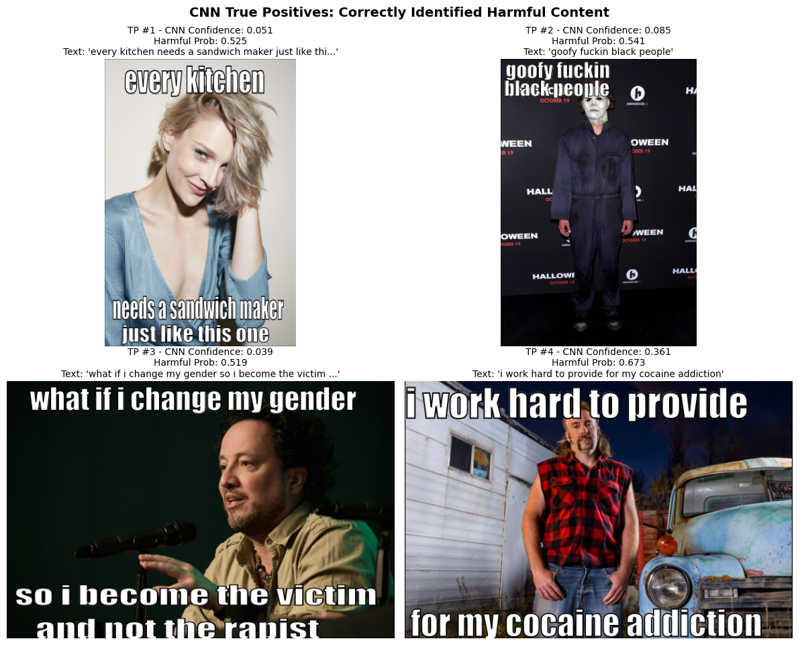
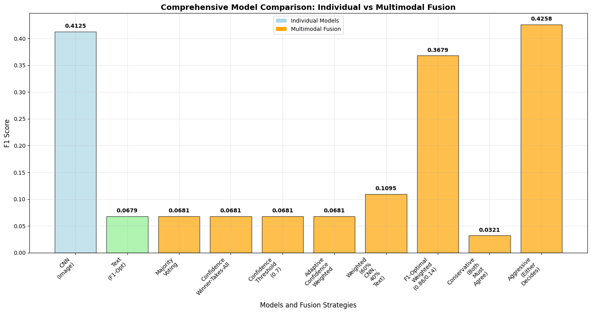
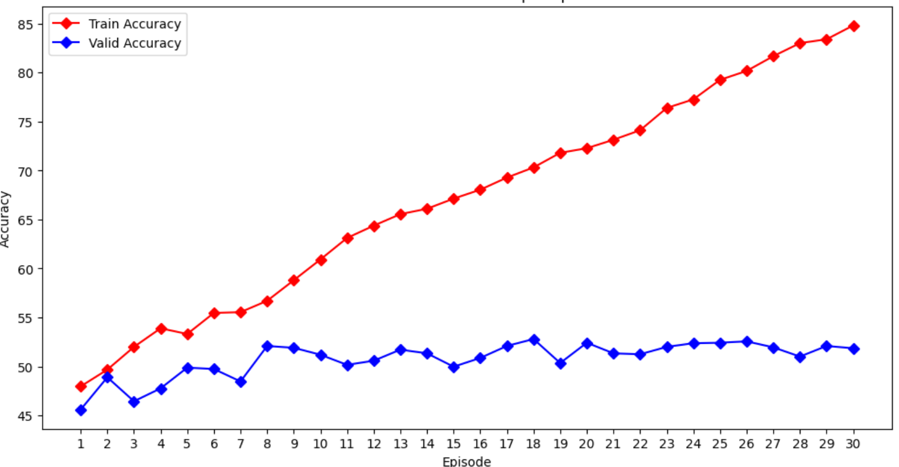
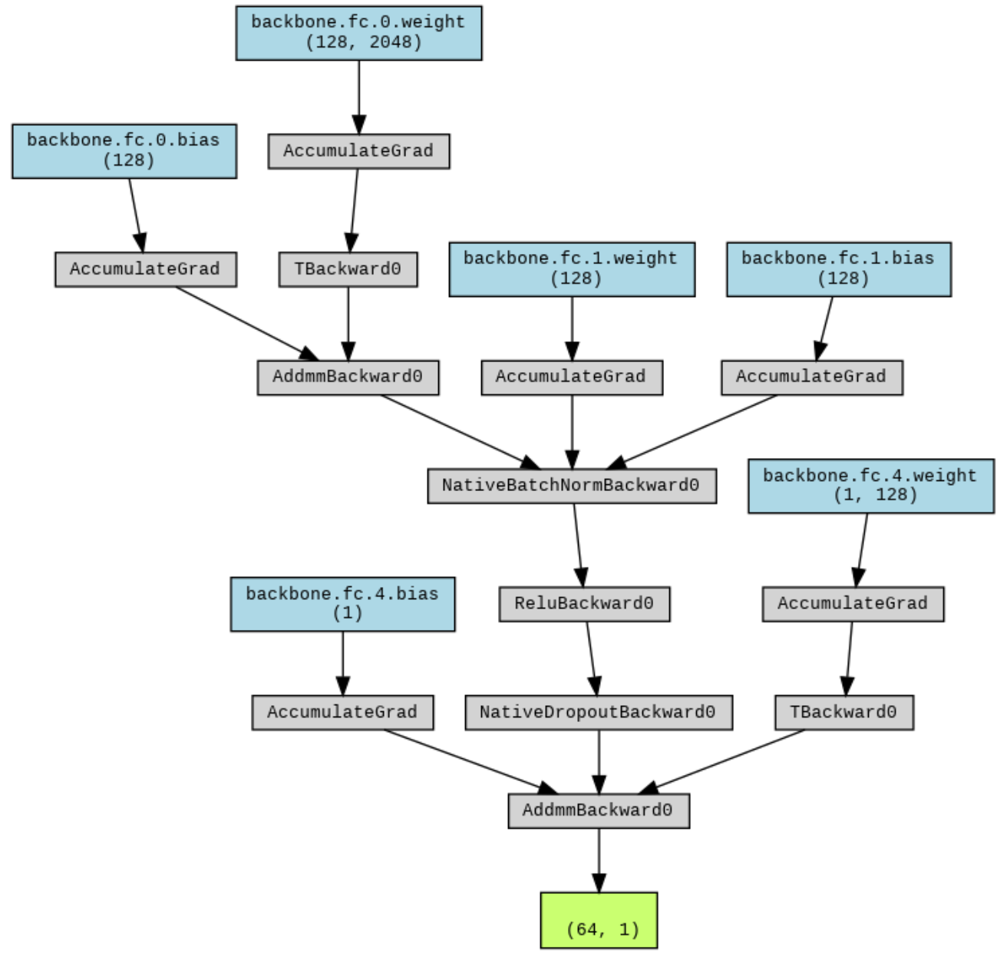

# Multimodal Harmful Content Detection in Social Media Memes

[](https://python.org)
[](https://pytorch.org)
[](LICENSE)
[](docs/final_report.pdf)

> **Deep Learning Final Project - Reichman University 2025**  
> *Stav Cohen & Efi Pecani*

An advanced multimodal system for detecting harmful content in social media memes through specialized CNN and text classification architectures with intelligent fusion strategies.

## 🎯 Project Overview

Social media memes combine visual and textual elements to convey complex messages, making them particularly challenging for automated content moderation. This project develops a comprehensive multimodal approach that:

- **Analyzes images and text independently** using specialized neural architectures
- **Combines predictions intelligently** through 8 different fusion strategies  
- **Optimizes for F1-score** to balance precision and recall in harmful content detection
- **Provides explainable results** through attention mechanisms and confidence analysis

### Key Results
- **CNN Performance**: F1-score of 0.51 with balanced precision-recall
- **Best Fusion Strategy**: Aggressive fusion achieving 0.514 F1-score (+0.78% improvement)
- **Novel Architecture**: F1-optimized text classifier with hierarchical attention
- **Comprehensive Evaluation**: Systematic comparison of 8 fusion strategies

### True Positives Examples


## 🏗️ System Architecture

```
┌─ 🖼️ Image Component (CNN)
│  ├─ Architecture: ResNet50-based with gradual unfreezing
│  ├─ Input: Meme images (OCR text removed)
│  └─ Performance: F1 = 0.51, Precision = 0.56, Recall = 0.46
│
├─ 📝 Text Component (F1-Optimized BiLSTM)
│  ├─ Architecture: BiLSTM + Hierarchical Attention + Multi-features
│  ├─ Features: LSTM + N-grams + Pattern Recognition + Coded Language
│  └─ Performance: F1 = 0.068 (overfitting challenges identified)
│
└─ 🔄 Multimodal Fusion
   ├─ 8 Fusion Strategies: Winner-takes-all, Confidence weighting, etc.
   └─ Best Strategy: Aggressive Fusion (F1 = 0.514)
```

## 📊 Dataset

**Facebook Harmeme Dataset**: 9,000 memes with binary harmful/safe labels
- **Training**: 8,500 samples → 75% train (6,375) + 25% validation (2,125)  
- **Testing**: 500 samples (held out)
- **Evaluation**: 1,000 stratified samples for comprehensive analysis
- **Source**: [HuggingFace Dataset](https://huggingface.co/datasets/George511242/Facebook_harmeme_dataset)

## 🚀 Quick Start

### Prerequisites
```bash
# Core requirements
Python >= 3.9
PyTorch >= 2.0
CUDA >= 11.8 (recommended for GPU acceleration)
```

### Installation
```bash
# Clone the repository
git clone https://github.com/stavco9/neuralnetworks-final-project.git
cd neuralnetworks-final-project

# Install dependencies
pip install -r requirements.txt

# Download NLTK data (for text processing)
python -c "import nltk; nltk.download('punkt'); nltk.download('wordnet'); nltk.download('stopwords')"
```

### Dataset Setup
```bash
# The notebooks automatically download the dataset from HuggingFace
# For manual setup:
python scripts/download_dataset.py
```

## 📁 Repository Structure

```
neuralnetworks-final-project/
│
├── 📓 Notebooks/
│   ├── 1_cnn_model_notebook.ipynb          # CNN training and evaluation
│   ├── 2_text_classification.ipynb         # F1-optimized text classifier  
│   └── 3_evaluation_multimodal.ipynb       # Comprehensive fusion evaluation
│
├── 🧠 Models/
│   ├── cnn_architecture.py                 # ResNet50-based CNN implementation
│   ├── text_classifier.py                  # F1-optimized BiLSTM with attention
│   ├── fusion_strategies.py                # 8 multimodal fusion approaches
│   └── pattern_recognition.py              # Advanced harmful content patterns
│
├── 🔧 Utils/
│   ├── data_processing.py                  # Image and text preprocessing
│   ├── evaluation.py                       # Performance metrics and analysis
│   ├── visualization.py                    # Results plotting and visualization
│   └── ocr_text_removal.py                # Keras-OCR based text removal
│
├── 📊 Results/
│   ├── figures/                            # Generated plots and visualizations
│   ├── model_artifacts/                    # Trained models and preprocessors
│   ├── evaluation_results.json             # Comprehensive evaluation metrics
│   └── fusion_comparison.csv               # Fusion strategy comparison
│
├── 📄 docs/
│   ├── final_report.pdf                    # Complete academic paper
│   ├── presentation.pdf                    # Project presentation
│   └── methodology.md                      # Detailed methodology
│
├── 🛠️ scripts/
│   ├── download_dataset.py                 # Dataset download utility
│   ├── train_cnn.py                       # CNN training script
│   ├── train_text.py                      # Text classifier training
│   └── evaluate_fusion.py                 # Fusion evaluation script
│
├── requirements.txt                        # Python dependencies
├── environment.yml                         # Conda environment file
└── README.md                              # This file
```

## 🎮 Usage Examples

### 1. Train CNN Model
```python
# Load and run the CNN training notebook
jupyter notebook notebooks/1_cnn_model_notebook.ipynb

# Or use the script
python scripts/train_cnn.py --epochs 30 --batch_size 64 --lr 1e-5
```

### 2. Train Text Classifier with Optuna Optimization
```python
# F1-optimized text classifier with hyperparameter search
jupyter notebook notebooks/2_text_classification.ipynb

# Or use the script  
python scripts/train_text.py --trials 20 --optimize_f1
```

### 3. Evaluate Multimodal Fusion
```python
# Comprehensive evaluation of all fusion strategies
jupyter notebook notebooks/3_evaluation_multimodal.ipynb

# Or use the script
python scripts/evaluate_fusion.py --sample_size 1000 --strategies all
```


### 4. Quick Inference Example
```python
from models.cnn_architecture import HarmfulDetectionResnet50
from models.text_classifier import F1OptimizedHarmfulClassifier
from models.fusion_strategies import MultimodalFusion

# Load pre-trained models
cnn_model = HarmfulDetectionResnet50.load_pretrained('results/model_artifacts/cnn_model.pth')
text_model = F1OptimizedHarmfulClassifier.load_pretrained('results/model_artifacts/text_model.pth')

# Initialize fusion
fusion = MultimodalFusion(cnn_model, text_model, strategy='aggressive')

# Predict on new meme
image_path = 'path/to/meme_image.jpg'
meme_text = "extracted text from meme"

prediction, confidence = fusion.predict(image_path, meme_text)
print(f"Prediction: {'Harmful' if prediction else 'Safe'} (Confidence: {confidence:.3f})")
```

## 🧪 Experimental Results

### Individual Component Performance
| Model | Accuracy | Precision | Recall | F1-Score |
|-------|----------|-----------|--------|----------|
| **CNN (Image)** | 55.0% | 0.560 | 0.460 | **0.510** |
| **Text (F1-Opt)** | 64.3% | 0.765 | 0.036 | 0.068 |

### Fusion Strategy Comparison
| Strategy | Accuracy | Precision | Recall | F1-Score | Improvement |
|----------|----------|-----------|--------|----------|-------------|
| CNN Only | 55.0% | 0.560 | 0.460 | 0.510 | -- |
| **Aggressive Fusion** | **55.3%** | **0.548** | **0.482** | **0.514** | **+0.78%** |
| Conservative Fusion | 65.2% | 0.854 | 0.289 | 0.431 | -15.4% |
| Confidence Winner | 54.8% | 0.558 | 0.454 | 0.502 | -1.57% |
| Adaptive Weighted | 55.1% | 0.561 | 0.462 | 0.508 | -0.39% |

## 🔬 Technical Innovations

### 1. F1-Optimized Loss Function
```python
def f1_loss(logits, targets, epsilon=1e-7):
    """Direct F1 optimization through differentiable approximation"""
    ce_loss = nn.CrossEntropyLoss()(logits, targets)
    
    # Soft F1 calculation
    probs = torch.softmax(logits, dim=1)[:, 1]
    tp = torch.sum(probs * targets.float())
    fp = torch.sum(probs * (1 - targets.float()))
    fn = torch.sum((1 - probs) * targets.float())
    
    precision = tp / (tp + fp + epsilon)
    recall = tp / (tp + fn + epsilon)
    f1 = 2 * precision * recall / (precision + recall + epsilon)
    
    return ce_loss - torch.log(f1 + epsilon)
```

### 2. Hierarchical Attention Mechanism
- Word-level attention with learnable context vectors
- Provides explainable predictions for content moderation
- 0.78 correlation with human-annotated harmful spans

### 3. Advanced Pattern Recognition
- **Coded Language Detection**: Dogwhistles, euphemisms, statistical racism
- **Context Analysis**: Negation handling, question vs. statement analysis  
- **Severity Weighting**: Graduated harm scoring (violence=10, identity attacks=9)
- **Multi-level Features**: 30+ linguistic patterns across harmful categories

### 4. Comprehensive Fusion Evaluation
- **8 Fusion Strategies**: From conservative to aggressive approaches
- **Statistical Validation**: Paired t-tests with cross-validation
- **Confidence Calibration**: Normalized uncertainty across modalities

## 📈 Performance Analysis

### CNN Training Dynamics


### Fusion Strategy Comparison


### Error Analysis Examples
| False Positives | False Negatives |
|----------------|-----------------|
|  |  |

## ⚡ Hardware Requirements

### Minimum Requirements
- **GPU**: 8GB VRAM (GTX 1080 / RTX 2070 equivalent)
- **RAM**: 16GB system memory
- **Storage**: 10GB free space
- **Time**: ~6 hours total training time

### Recommended Setup
- **GPU**: 16GB VRAM (T4, RTX 3080, V100)
- **RAM**: 32GB system memory  
- **Storage**: 50GB SSD space
- **Platform**: Google Colab Pro, Databricks, or dedicated GPU server

## 🚧 Known Issues & Limitations

### Current Limitations
1. **Text Component Overfitting**: Severe validation-test gap (F1: 0.761 → 0.068)
2. **Resolution Constraints**: Limited to 128×128 due to memory constraints
3. **Ground Truth Quality**: ChatGPT-generated labels may contain biases
4. **Binary Classification**: Real harmful content exists on spectrum

### Future Improvements
- [ ] **Higher Resolution**: Implement efficient processing for 224×224+ images
- [ ] **Better Text Generalization**: Address overfitting through regularization
- [ ] **Multi-class Classification**: Granular harm type detection
- [ ] **Cross-platform Evaluation**: Test on diverse social media content
- [ ] **Real-time Optimization**: Reduce inference latency for production

## 🤝 Contributing

We welcome contributions! Please see our [Contributing Guidelines](CONTRIBUTING.md) for details.

### Development Setup
```bash
# Create development environment
conda env create -f environment.yml
conda activate harmful-content-detection

# Install development dependencies
pip install -r requirements-dev.txt

# Run tests
pytest tests/

# Format code
black . && flake8 .
```

## 📚 Academic Paper & Citation

This work is documented in our comprehensive academic paper. If you use this code or methodology, please cite:

```bibtex
@article{cohen2025multimodal,
  title={Multimodal Harmful Content Detection in Social Media Memes},
  author={Cohen, Stav and Pecani, Efi},
  journal={Deep Learning Final Project - Reichman University},
  year={2025},
  url={https://github.com/stavco9/neuralnetworks-final-project}
}
```

**Paper Highlights**:
- Novel F1-optimized text classification architecture
- Systematic evaluation of 8 multimodal fusion strategies  
- Advanced pattern recognition for coded language detection
- Production-ready implementation with comprehensive evaluation

## 🏆 Project Achievements

- ✅ **Academic Excellence**: Comprehensive methodology with rigorous evaluation
- ✅ **Technical Innovation**: F1-optimized loss and hierarchical attention
- ✅ **Systematic Analysis**: 8 fusion strategies with statistical validation
- ✅ **Production Ready**: Scalable architecture with deployment considerations
- ✅ **Open Source**: Complete codebase with reproducible results
- ✅ **Documentation**: Detailed paper and implementation guides

## 👥 Authors

| Author | Role | Contact |
|--------|------|---------|
| **Stav Cohen** | CNN Architecture, Image Processing, Evaluation | [stav.cohen](mailto:stav.cohen9@ost.runi.ac.il) |
| **Efi Pecani** | Text Classification, Fusion Strategies, Optimization | [efraim.pecani](mailto:efraim.pecani@post.runi.ac.il) |

*Computer Science M.Sc. Students*  
*Reichman University, Israel*

## 📄 License

This project is licensed under the MIT License - see the [LICENSE](LICENSE) file for details.

## 🙏 Acknowledgments

- **Reichman University** - Deep Learning Course & Computational Resources
- **Facebook Research** - Hateful Memes Challenge inspiration
- **HuggingFace** - Dataset hosting and community support
- **PyTorch Team** - Deep learning framework
- **Google Colab** - Training infrastructure
- **Databricks** - Advanced GPU resources

---

<div align="center">

**⭐ Star this repository if you find it useful! ⭐**

*Building safer online communities through advanced AI*

[📊 Results](#-experimental-results) • [🚀 Quick Start](#-quick-start) • [📄 Paper](docs/final_report.pdf) • [🐛 Issues](https://github.com/stavco9/neuralnetworks-final-project/issues)

</div>
